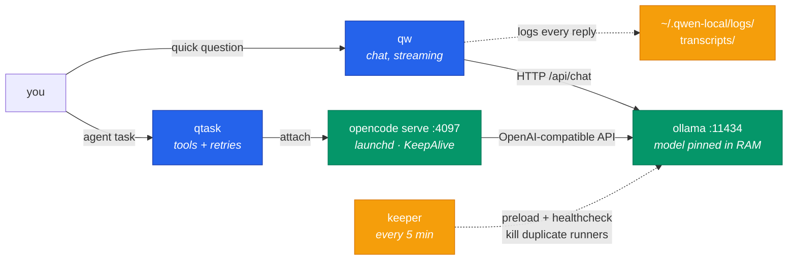
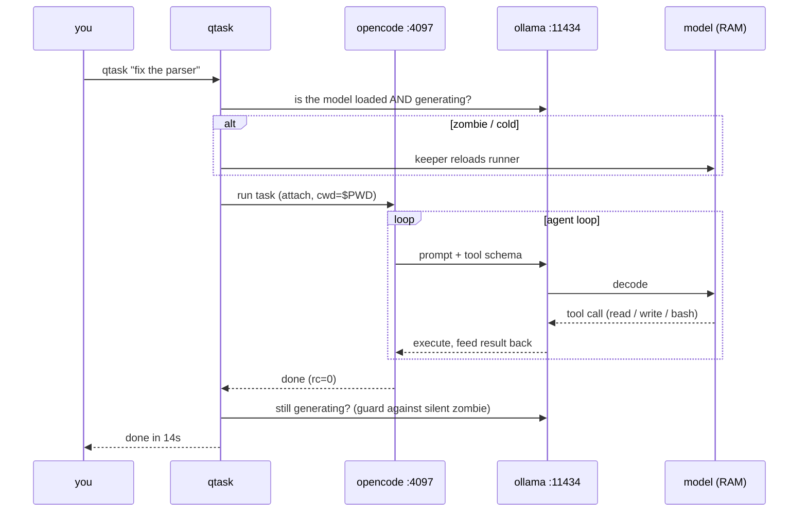
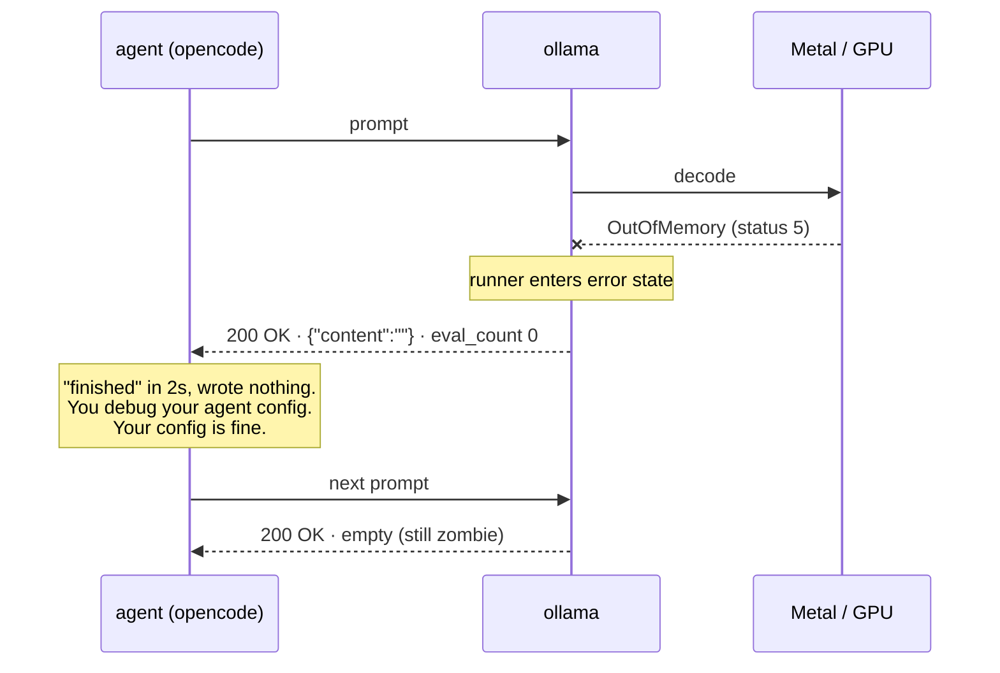
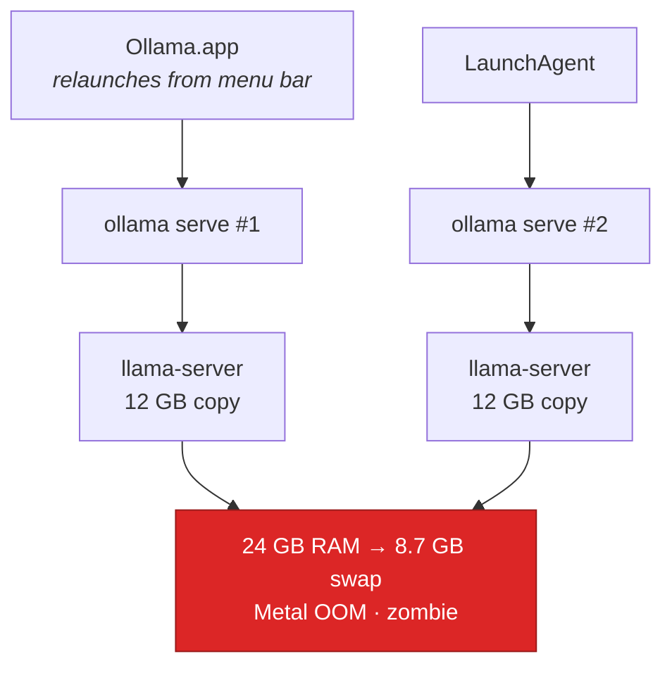
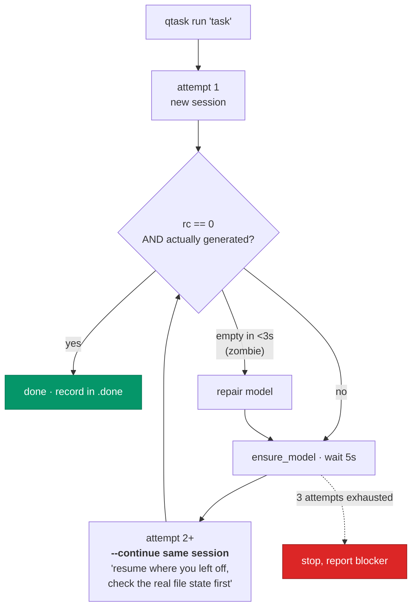

# local-llm-longrun

Turn a local ollama model into a coding agent that feels like Claude Code:
**resident in memory**, with CLI tools, persistent sessions, and long-running
tasks that survive a crash and get recreated.

Tested on a MacBook Pro (M4 Pro, 24 GB) running a 35B Qwen3.5 MoE (A3B) at 2-bit
(IQ2_M, 16K context).

> **Why this repo exists.** Everyone tells you *which* local model to run. Almost
> nobody tells you that the model isn't what makes local agents feel broken — the
> *runtime* is. This repo documents four silent failure modes I hit building this,
> and ships the tooling that fixes them.

---

## The problem

You download a model, try it with `ollama run`, it works great. You wire it into
an agent and the experience falls apart: every task takes a minute, sometimes the
agent finishes instantly doing nothing (no error), and the code it writes looks
worse than in the chat.

Almost none of that is the model's fault. Four runtime problems nobody warns you
about:

| Symptom | Real cause |
|---|---|
| First request takes ~20s | The model gets evicted from memory after 5 min (default `keep_alive`) |
| Agent finishes instantly, no output, no error | GPU ran out of memory; **ollama keeps replying HTTP 200 with an empty body** |
| Code comes out repetitive or wrong | The model ships with a high `presence_penalty`, which is poison for code |
| Erratic behavior with no pattern | You have **two ollama servers** fighting over port 11434 |

This repo fixes all four and adds the "long running" layer on top.

---

## How it works

Two commands sit on top of a resident ollama model and a persistent opencode
server:



- **ollama** under launchd with `OLLAMA_KEEP_ALIVE=-1`: the model never unloads.
- **keeper**: preloads it at boot and detects the "zombie runner" (below).
- **opencode serve** persistent: a task drops from ~60s to ~14s.
- **qtask**: retries that *preserve* the session, and resumable queues.

### The request lifecycle

`qw` talks straight to ollama for speed. `qtask` goes through the persistent
opencode server so it gets the tool-calling agent loop without paying startup
cost each time:



---

## Install

Requirements: macOS (Apple Silicon), [ollama](https://ollama.com/download), and
[opencode](https://opencode.ai) (`brew install sst/tap/opencode`).

```bash
git clone https://github.com/espinosacodes/local-llm-longrun
cd local-llm-longrun
./install.sh
```

With a different base model:

```bash
BASE_MODEL=qwen2.5-coder:14b MODEL_NAME=coder NUM_CTX=32768 ./install.sh
```

**Pick the quant by what fits, not by what sounds best.** Read the OOM section
before deciding.

---

## Usage

```bash
qw "why does this regex fail"         # first token in ~1s
cat error.log | qw "what does this mean"   # reads stdin
qw -c "Go debounce function"          # code only, no prose
qw -t "..."                           # show the reasoning
qw -l                                 # last reply, even after you closed the terminal
qw --log                              # list saved transcripts

qtask serve                           # persistent server (do this once)
qtask "fix the tests in scraper/"     # agent, in the current directory
qtask cont "now add one more test"    # continue the same session
qtask queue tasks.txt                 # resumable queue, one task per line
qtask queue plan.md                   # or a Markdown plan: runs its checklist items
qtask tui                             # interactive TUI
qtask web                             # web UI

qtask status                          # loaded? server up? right model?
qtask doctor                          # diagnose and repair
qtask unload                          # free the GB when you need the RAM
```

---

## The decisions that matter

### 1. `keep_alive: -1` — the model has to stay resident

By default ollama unloads the model after 5 minutes idle. For an agent that means
paying 15–45s of load time every time you come back from a coffee. The config
pins it forever and the keeper preloads it at boot.

The cost is honest: it's GB of RAM held all the time. That's why `qtask unload`
exists — it frees them without shutting anything down.

### 2. The quant has to fit **with headroom** (the silent failure)

This is the one that costs you an afternoon.

A 24 GB Mac doesn't give 24 GB to the GPU: the limit (`iogpu.wired_limit`) is
around 16 GB. A 15.9 GB model *loads fine*, *answers fine for a while*, then with
a long agent prompt it blows up:

```
ggml_metal_synchronize: error: command buffer 0 failed with status 5
error: Insufficient Memory (kIOGPUCommandBufferCallbackErrorOutOfMemory)
llama_decode: failed to decode, ret = -3
srv update_slots: decode() failed: Compute error.
```

And here's the cruel part: **after that ollama does not return an error.** It
returns `200 OK` with an empty body, forever, until you restart the runner:



**The rule:** leave ~3 GB of headroom over the weights. On 24 GB, that's a ~13 GB
model, not 16. Dropping from Q2_K to IQ2_M on the same model cost 3.4 GB and made
it stable — and IQ2_M is usually *better* per byte than Q2_K.

Context isn't the problem: the KV cache of a small-embedding MoE is cheap (~0.7 GB
per 49K tokens). The weights are.

If you genuinely need the big quant:

```bash
sudo sysctl iogpu.wired_limit_mb=20480   # 20 GB to the GPU; not persistent across reboot
```

`qtask doctor` detects this state, kills the runner and recreates it.

### 3. `presence_penalty 0` for code

Many community models ship with `presence_penalty` at 1.0–1.5. In prose it adds
variety. In code it penalizes reusing the same identifier, import, keyword —
exactly what code *has* to do. This repo's `Modelfile` sets it to 0, with
`temperature 0.15` and `top_p 0.8` so tool-calls come out stable. Check what your
model ships with before blaming it: `ollama show your-model`.

### 4. One ollama server, one runner

On macOS the Ollama.app launches its own `ollama serve` — and on `0.0.0.0:11434`,
i.e. **exposed to your whole local network**. If you also have the LaunchAgent,
two processes fight over the port, each with different config. Erratic behavior
with no pattern.

Worse: **each server loads its own copy of the model.** Two 12 GB runners in 24 GB
of RAM send the system into swap, Metal runs out of GPU memory, and the runner
dies on every `decode` — the zombie from #2, but permanent until you kill the
duplicate.



Only the LaunchAgent should win, on `127.0.0.1`. Check it:

```bash
lsof -nP -iTCP:11434 -sTCP:LISTEN   # must print ONE line
pgrep -fl "llama-server"            # must print ONE runner
```

The keeper detects and kills duplicate servers/runners on every pass, but that's
a patch. The cure is to **quit the Ollama.app from the menu bar and not reopen it.**

### 5. Persistent server: 60s → 14s

Each standalone `opencode run` pays runtime startup, config read, plugin load and
LSP boot. With a persistent `opencode serve` under launchd (`KeepAlive`, self-
healing), the same task drops from ~60s to ~14s.

It runs with basic-auth even though it only listens on localhost, because **that
server executes arbitrary bash**: without a password, any local process — or a
webpage via DNS rebinding — could drive it. The password is generated into
`~/.qwen-local/server-pass` with mode 600.

### 6. Retry without losing context

A dumb retry repeats the original prompt and the model redoes work already done
(or duplicates it). `qtask` retries with `--continue` on **the same session** and
a different instruction, so a task that dies halfway resumes instead of starting
over:



`qtask queue` keeps a `.done` file: cut the queue and relaunch, and it skips what
already completed. That's what lets a long run survive the process dying and being
recreated.

It takes two shapes of input. A **flat list** runs one task per line (blank lines
and `#` comments ignored). A **Markdown plan** (`.md` with tables, code fences,
blockquotes, or checklists) is parsed instead of executed line by line: only its
actionable items become tasks (`- [ ]`, `-`, `*`, `1.`), stripped of their marker;
`- [x]` items count as already done, and headings, tables, quotes, rules, code
blocks, and prose are skipped. Feed it a plan with no actionable items and it stops
with a message rather than trying to "run" the prose. This is deliberate: handed a
plan as a flat list, the model tried to execute table rows and headings, ran out of
its 16K context, and looped without ever getting past the document.

Every attempt also has a wall-clock ceiling (`QTASK_MAX_SECS`, default 900s). A run
that wedges in a loop is killed instead of grinding for hours; when it was attached
to the persistent server, the server is restarted so the runaway session dies with
it, not just the client.

### 7. A small model needs hard rules, not a pretty prompt

In testing, the model asked to read `datos.txt`, wrote `data.txt`, failed, and
then **copied a `data.txt` from `~/Downloads`** to make its own mistake line up.
It reported "verified" against a file that wasn't the user's.

So the bundled agent ships with `external_directory: deny` and explicit
exact-filename rules. It also strips tools that only burn context (`todowrite`,
`webfetch`, subagents). With fewer tools and harder rules, the same model passed
the task on the first try.

### 8. `ollama run` doesn't save what the model tells you

`~/.ollama/history` saves **only your prompts**. Replies aren't stored anywhere.
If the model writes you a README and you close the terminal, it's gone. So `qw`
writes every exchange to `~/.qwen-local/logs/transcripts/YYYY-MM-DD.md`, and
`qw -l` gives you the last reply back. `qtask` sessions live in opencode's database,
so they persist too.

---

## Quick diagnosis

```bash
qtask doctor
```

| What you see | What it is |
|---|---|
| Empty reply, `eval_count: 0`, HTTP 200 | GPU OOM. Smaller quant or `iogpu.wired_limit_mb` |
| Agent finishes in 2s with no output | Same thing, seen from opencode |
| First request always slow | Keeper isn't running: `launchctl list \| grep qwen` |
| Weird, inconsistent replies | Two servers on 11434: `lsof -nP -iTCP:11434 -sTCP:LISTEN` |
| Repetitive code | `ollama show your-model` → check `presence_penalty` |
| A `queue` task runs for many minutes and repeats itself | Out of context, looping. If you fed a `.md` plan, `queue` now parses its checklist instead of the raw lines; `QTASK_MAX_SECS` caps each attempt |
| `low max file descriptors` / `Unexpected` on `web`/`tui` | Terminal opened with a low FD limit (Warp ~2560); opencode's watcher exceeds it in a big repo. `qtask` raises its own soft limit before launching; the launchd server plist sets 65536. No sudo needed — the hard limit is unlimited on macOS. |

Logs: `~/.ollama/logs/server.log` (grep `OutOfMemory`) and `~/.qwen-local/logs/`.

---

## Measured numbers

M4 Pro, 24 GB, Qwen3.5-35B-A3B IQ2_M (12.5 GB resident, 16K context):

| | |
|---|---|
| Generation | ~48 tok/s |
| Prefill, 13K context | ~670 tok/s (~20s) |
| Cold load | ~15s |
| Simple agent task, server up | ~14s |
| Simple agent task, no server | ~60s |

## What to expect from quality

A 35B at 2-bit is for mechanical, scoped work: write a script, fix a test, rename
things, summarize a log. Not for design or large refactors without supervision.

Give it **verifiable** work (compiles, passes tests) and review the diff. The
point of this repo isn't that the model is smart — it's that the runtime stops
sabotaging it.

## Uninstall

```bash
./uninstall.sh
```

## License

MIT
