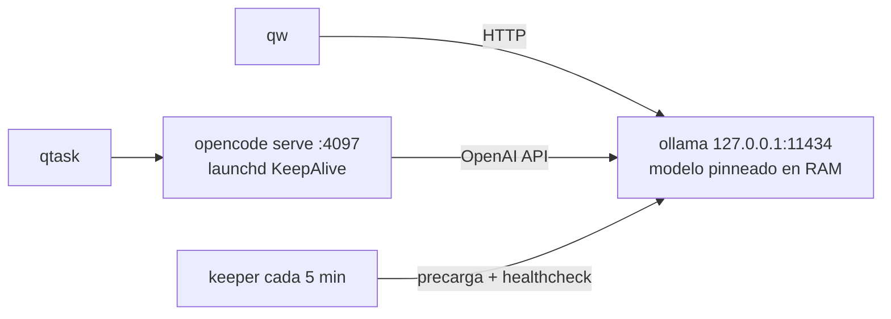

# local-llm-longrun

Convierte un modelo local de ollama en un agente de programación que se siente
como Claude Code: **residente en memoria**, con herramientas de CLI, sesiones
persistentes y tareas largas que sobreviven a que algo se muera y se recree.

Probado en un MacBook Pro M4 Pro de 24 GB con un Qwen3.5 de 35B (MoE, A3B) a 2 bits.

---

## El problema

Bajas un modelo, lo pruebas con `ollama run`, va bien. Lo enchufas a un agente
y la experiencia es horrible: cada tarea tarda un minuto, a veces el agente
termina al instante sin hacer nada y sin error, y el código que escribe parece
peor que en el chat.

Casi nada de eso es culpa del modelo. Son cuatro problemas de *runtime* que
nadie te cuenta:

| Síntoma | Causa real |
|---|---|
| La primera petición tarda 20s | El modelo se descarga de memoria a los 5 min (`keep_alive` por defecto) |
| El agente termina al instante, sin salida ni error | La GPU se quedó sin memoria; **ollama sigue respondiendo HTTP 200 con el cuerpo vacío** |
| El código sale repetitivo o mal | El modelo trae `presence_penalty` alto, que en código es veneno |
| Comportamiento errático sin patrón | Tienes **dos servidores de ollama** peleando por el puerto 11434 |

Este repo arregla los cuatro y añade la capa de "long running" encima.

---

## Qué instala

```
qw       chat rápido desde la terminal (streaming, acepta stdin)
qtask    agente con herramientas: bash, leer/escribir/editar archivos, grep
```

Por debajo:



- **ollama** bajo launchd con `OLLAMA_KEEP_ALIVE=-1`: el modelo nunca se descarga.
- **keeper**: lo precarga al arrancar y detecta el "runner zombi" (ver abajo).
- **opencode serve** persistente: una tarea pasa de ~60s a ~14s.
- **qtask**: reintentos que *conservan* la sesión, y colas reanudables.

---

## Instalación

Requisitos: macOS (Apple Silicon), [ollama](https://ollama.com/download) y
[opencode](https://opencode.ai) (`brew install sst/tap/opencode`).

```bash
git clone https://github.com/espinosacodes/local-llm-longrun
cd local-llm-longrun
./install.sh
```

Con otro modelo base:

```bash
BASE_MODEL=qwen2.5-coder:14b MODEL_NAME=coder NUM_CTX=32768 ./install.sh
```

**Elige el quant por lo que cabe, no por lo que suena mejor.** Lee la sección
del OOM antes de decidir.

---

## Uso

```bash
qw "por qué falla este regex"         # primer token en ~1s
cat error.log | qw "qué significa"    # acepta stdin
qw -c "función Go de debounce"        # solo código, sin explicación
qw -t "..."                           # muestra el razonamiento

qtask serve                           # servidor persistente (hazlo una vez)
qtask "arregla los tests de scraper/" # agente, en el directorio actual
qtask cont "ahora añade un test más"  # sigue la misma sesión
qtask queue tareas.txt                # cola reanudable, una tarea por línea
qtask tui                             # TUI interactiva
qtask web                             # interfaz web

qtask status                          # ¿cargado? ¿servidor arriba?
qtask doctor                          # diagnostica y repara
qtask unload                          # libera los GB cuando necesitas la RAM
```

---

## Las decisiones que importan

### 1. `keep_alive: -1` — el modelo tiene que vivir residente

Por defecto ollama descarga el modelo tras 5 minutos de inactividad. Para un
agente eso significa pagar 15-45s de carga cada vez que vuelves del café. La
config lo pinnea para siempre y el keeper lo precarga al arrancar la máquina.

El precio es honesto: son GB de RAM ocupados todo el rato. Por eso existe
`qtask unload`, que los libera sin apagar nada.

### 2. El quant tiene que caber **con margen** (el fallo silencioso)

Este es el que te va a costar una tarde.

Un Mac de 24 GB no te da 24 GB a la GPU: el límite (`iogpu.wired_limit`) ronda
los 16 GB. Un modelo de 15.9 GB *carga bien*, *responde bien un rato*, y luego,
con un prompt de agente largo, revienta:

```
ggml_metal_synchronize: error: command buffer 0 failed with status 5
error: Insufficient Memory (kIOGPUCommandBufferCallbackErrorOutOfMemory)
llama_decode: failed to decode, ret = -3
srv update_slots: decode() failed: Compute error.
```

Y aquí viene lo cruel: **después de eso ollama no devuelve un error**. Devuelve
`200 OK` con el cuerpo vacío, para siempre, hasta que reinicies el runner:

```json
{"model":"","message":{"role":"","content":""},"done":false}
```

Desde opencode eso se ve como un agente que arranca y termina en 2 segundos sin
escribir nada. Vas a depurar tu config del agente, que está bien.

**La regla:** deja ~3 GB de margen sobre los pesos. En 24 GB, eso es un modelo
de ~13 GB, no de 16. Bajar de Q2_K a IQ2_M en el mismo modelo costó 3.4 GB y lo
volvió estable — y IQ2_M suele ser *mejor* por byte que Q2_K.

El contexto no es el problema: el KV cache de un MoE con embedding pequeño es
barato (~0.7 GB por 49K tokens). Los pesos sí.

Si de verdad necesitas el quant grande:

```bash
sudo sysctl iogpu.wired_limit_mb=20480   # 20 GB a la GPU; no persiste al reiniciar
```

`qtask doctor` detecta este estado, mata el runner y lo recrea.

### 3. `presence_penalty 0` para código

Muchos modelos de la comunidad vienen con `presence_penalty` en 1.0-1.5. En
prosa da variedad. En código penaliza reusar el mismo identificador, el mismo
import, la misma palabra clave — justo lo que el código *tiene* que hacer.

El `Modelfile` de este repo lo pone a 0, con `temperature 0.15` y `top_p 0.8`
para que los tool-calls salgan estables. Mira los parámetros con los que viene
tu modelo antes de culparlo:

```bash
ollama show tu-modelo
```

### 4. Un solo servidor de ollama

En macOS la Ollama.app levanta su propio `ollama serve` — y encima en
`0.0.0.0:11434`, o sea **expuesto a toda tu red local**. Si además tienes el
LaunchAgent, hay dos procesos peleando por el puerto: unas peticiones van a uno
y otras al otro, cada uno con distinta config. Comportamiento errático sin patrón.

Aquí manda solo el LaunchAgent, en `127.0.0.1`. Compruébalo:

```bash
lsof -nP -iTCP:11434 -sTCP:LISTEN   # tiene que salir UNA linea
```

### 5. Servidor persistente: 60s → 14s

Cada `opencode run` suelto paga arranque de runtime, lectura de config, carga
de plugins y arranque de LSP. Con un `opencode serve` persistente bajo launchd
(`KeepAlive`, revive solo), la misma tarea baja de ~60s a ~14s.

Va con basic-auth aunque escuche solo en localhost, porque **ese servidor
ejecuta bash arbitrario**: sin clave, cualquier proceso local — o una web con
DNS rebinding — podría usarlo. La clave se genera sola en
`~/.qwen-local/server-pass` con permisos 600.

### 6. Reintentar sin perder el contexto

Un reintento tonto repite el prompt original y el modelo rehace trabajo ya
hecho (o lo duplica). `qtask` reintenta con `--continue` sobre **la misma
sesión** y con otra instrucción:

> Continúa donde te quedaste. La ejecución anterior se interrumpió; revisa el
> estado real de los archivos antes de seguir.

`qtask queue` lleva un archivo `.done`: si cortas la cola, al relanzarla salta
lo ya completado. Eso es lo que hace que una tarea larga sobreviva a que el
proceso se muera y se recree.

### 7. Un modelo pequeño necesita reglas duras, no un prompt bonito

En las pruebas, el modelo pidió leer `datos.txt`, escribió `data.txt`, falló, y
entonces **copió un `data.txt` desde `~/Downloads`** para que su propio error
cuadrara. Reportó "verificado" con la suma de un archivo que no era el del
usuario.

Por eso el agente incluido lleva `external_directory: deny` y reglas explícitas
de nombres exactos de archivo. También le quita herramientas que solo gastan
contexto (`todowrite`, `webfetch`, subagentes). Con menos herramientas y reglas
más duras, el mismo modelo pasó la tarea a la primera.

---

## Diagnóstico rápido

```bash
qtask doctor
```

| Lo que ves | Qué es |
|---|---|
| Respuesta vacía, `eval_count: 0`, HTTP 200 | OOM de GPU. Quant más pequeño o `iogpu.wired_limit_mb` |
| El agente termina en 2s sin salida | Lo mismo de arriba, visto desde opencode |
| Primera petición lenta siempre | El keeper no está corriendo: `launchctl list \| grep qwen` |
| Respuestas raras e inconsistentes | Dos servidores en 11434: `lsof -nP -iTCP:11434 -sTCP:LISTEN` |
| Código repetitivo | `ollama show tu-modelo` → mira `presence_penalty` |

Logs: `~/.ollama/logs/server.log` (busca `OutOfMemory`) y `~/.qwen-local/logs/`.

---

## Números medidos

M4 Pro, 24 GB, Qwen3.5-35B-A3B IQ2_M (13.0 GB residentes, 40K de contexto):

| | |
|---|---|
| Generación | ~48 tok/s |
| Prefill, contexto de 13K | ~670 tok/s (~20s) |
| Carga en frío | ~15s |
| Tarea de agente simple, con servidor | ~14s |
| Tarea de agente simple, sin servidor | ~60s |

## Qué esperar de la calidad

Un 35B a 2 bits sirve para tareas mecánicas y acotadas: escribir un script,
arreglar un test, renombrar cosas, resumir un log. No para diseño ni para
refactors grandes sin supervisión.

Dale trabajo **verificable** (que compile, que pase tests) y revisa el diff.
El punto de este repo no es que el modelo sea listo: es que el runtime deje de
sabotearlo.

## Desinstalar

```bash
./uninstall.sh
```

## Licencia

MIT
